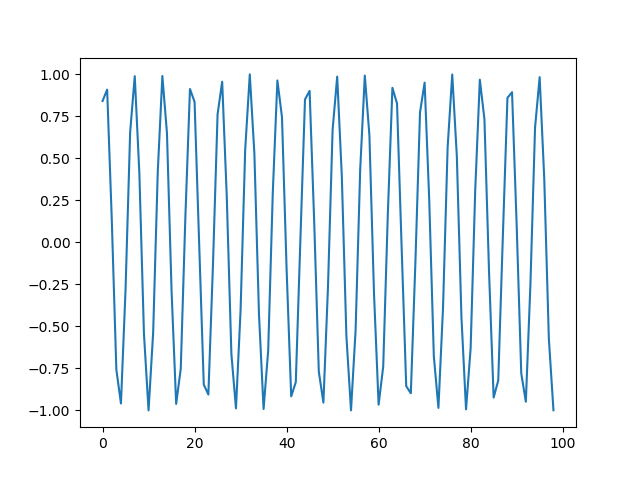
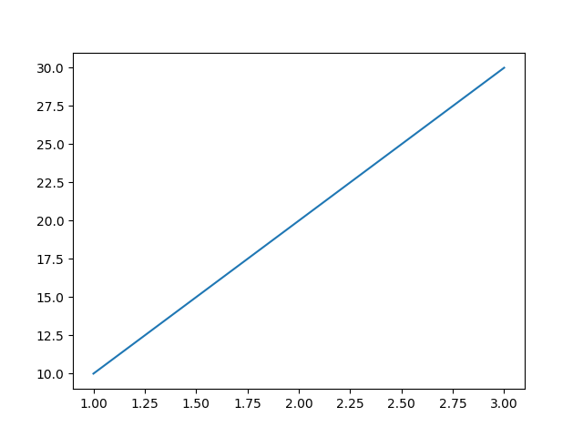
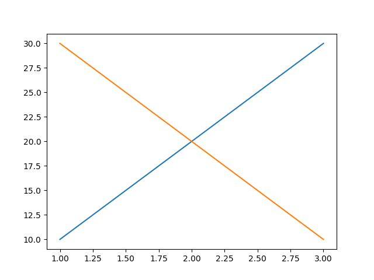
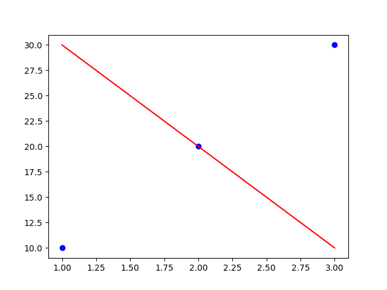
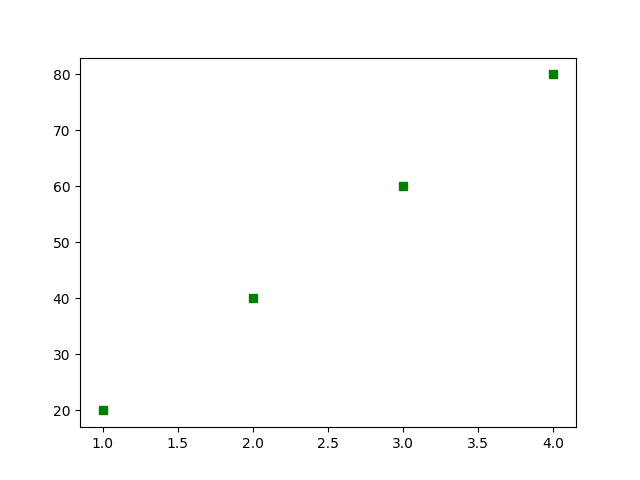

# CPlot

A very simple matplotlib wrapper to plot columns from a data file.

## Installation

You need Python installed, as well as Pandas and Matplotlib. Then, simply copy the `cplot` script to somewhere on your `$PATH`.

## Usage

```
usage: cplot [-h] [-s SEP] [-x X] [-y [Y [Y ...]]] [-he] [-f [FMT [FMT ...]]]
             [-gb GROUPBY] [-a AGG]
             file

Plot some columns.

positional arguments:
  file                  path to the data file

optional arguments:
  -h, --help            show this help message and exit
  -s SEP, --sep SEP     the separator between columns in the data, default to
                        comma ","
  -x X, --x X           column representing x, defaults to None
  -y [Y [Y ...]], --y [Y [Y ...]]
                        column(s) representing y
  -he, --header         is the first row a header?
  -f [FMT [FMT ...]], --fmt [FMT [FMT ...]]
                        plot format, same convention as pyplot.plot() fmt
                        argument. Can be list where each item is format for
                        different y column
  -gb GROUPBY, --groupby GROUPBY
                        column to group data by. Pandas groupby() is applied
                        internally
  -a AGG, --agg AGG     numpy function to aggregate grouped table by mean,
                        median, sum, std or cumsum. Defaults to mean
  -c COMMENT, --comment COMMENT
                        ignore lines denoted by this comment character.
```

### The simplest example

For example, for the one column data structure ([example/sin.txt](example/sin.txt)):

```
0.8414709848078965
0.9092974268256817
...
-0.9992068341863537
```

To plot a line graph:

```bash
cplot example/sin.txt
```



### Multiple columns, seperators and formats

For example, for the data structure ([example/multicol.txt](example/multicol.txt)):

```
x;y1;y2
1;10;30
2;20;20
3;30;10
```

To plot `x` vs `y1`:

```bash
cplot example/multicol.txt -s ";" -he -x 0 -y 1
# OR
cplot example/multicol.txt -s ";" -he -x x -y y1
```



To plot `x` vs `y1` and `y2`:

```bash
cplot example/multicol.txt -s ";" -he -x x -y y1 y2
# OR
cplot example/multicol.txt -s ";" -he -x 0 -y 1 2
```



Changing the plot formats:

```bash
cplot example/multicol.txt -s ";" -he -x x -y y1 y2 -f bo r-
```



### Groupby

Cplot deals with the simplest of "groupby" operations; namely, grouping by one column using one aggregation function. The column to group by is provided by the `-gb` or `--groupby` flag, and the aggregation function by the `-a` or `--agg` flag (which defaults to "mean"). Internally, [pandas.DataFrame.groupby()](https://pandas.pydata.org/pandas-docs/stable/reference/api/pandas.DataFrame.groupby.html) is used (i.e. `DataFrame.group([-gb])).agg(np.-a)`).

For example, if you have the data structure [example/groupby.txt](example/groupby.txt):

```
t,x,y,z
1,1,1,10
1,1,2,10
2,1,1,20
2,1,2,20
3,1,1,30
3,1,2,30
4,1,1,40
4,1,2,40
```

To plot `t` against the *sum* of `z` when grouped by `x` and `y`:

```bash
cplot example/groupby.txt -he -gb t -a sum -x t -y z -f gs
```



Permitted aggregation functions (which are NumPy functions) are mean, median, sum and std.

### Comments in files

You can ignore lines which are commented out by providing the comment character as an argument. For example, if you have the data structure:

```
# This is a comment
x,y
1,2
2,3
3,4
```

To plot `x` against `y`:

```bash
cplot example/comment.txt -he -c# -x x -y y
```
